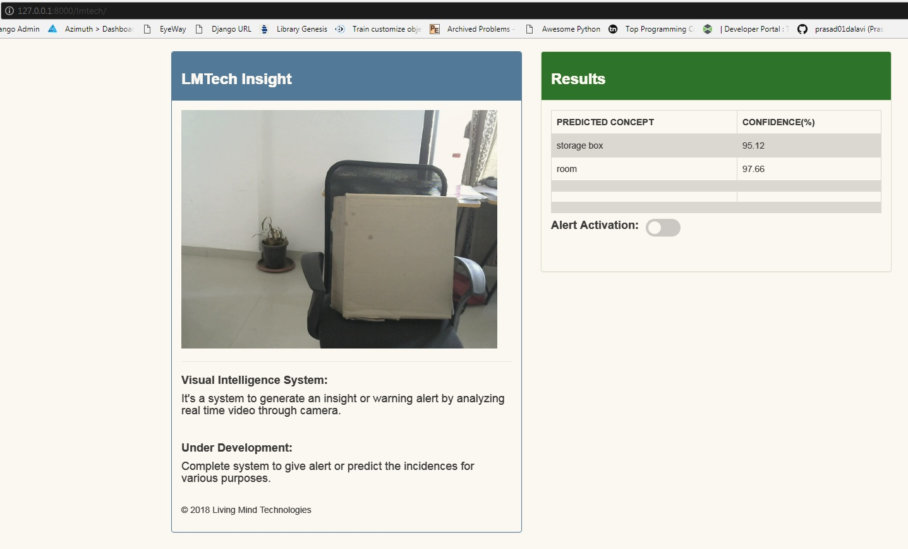

# Storage Box Detection
Detects Storage Box (cardboard, container) using Clarifai 


 <p align="center">
  
 </p> 
 

## Installations and Setup:
```bash
pip install clarifai===2.1.0

pip install flask

pip install opencv

```

<hr>
Run main.py from the webcam_server directory. This will start the flask application to render video feed for our application


Then start the Django Server using python manage.py runserver and visit the following link:

http://127.0.0.1:8000/lmtech/
